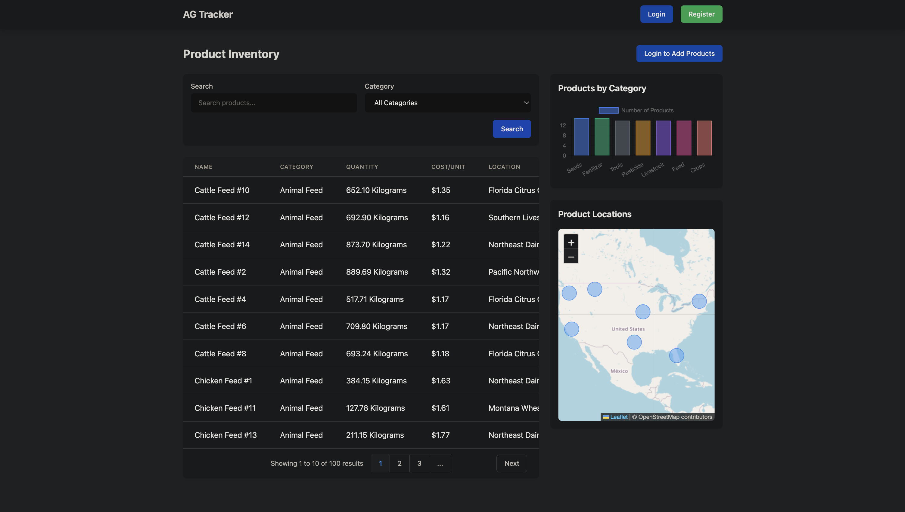

# AG Tracker (WIP)

A Django+HTMX web application for tracking agricultural products

## Preview


## Prerequisites

- Python 3.12.6
- pip (included with Python)

## Installation

1. Clone the repository:
```bash
git clone https://github.com/nax3t/ag_tracker.git
cd ag_tracker
```

2. Create and activate a virtual environment:
```bash
python -m venv .venv
source .venv/bin/activate  # On Windows, use: .venv\Scripts\activate
```

3. Install dependencies:
```bash
pip install -r requirements.txt
```

4. Set up the database:
```bash
python manage.py migrate
```

5. Load sample data (optional):
```bash
python manage.py seed_data
```

6. Run the development server:
```bash
python manage.py runserver
```

Visit `http://localhost:8000` in your browser to access the application.

## Features

- Product management
- Tabular data display
- Search and filter functionality
- Bar chart and Map visualization

## Notes

- This project is still in development and may have bugs or incomplete features.
- Much of the development was done with AI editors like Windsurf and Cursor, additinal review and revision will be needed to improve the code quality.